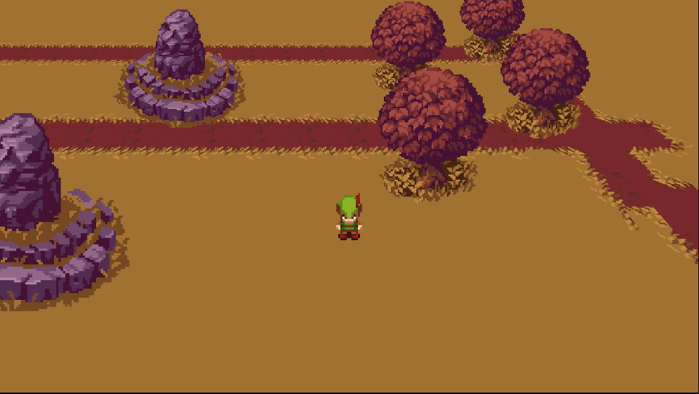
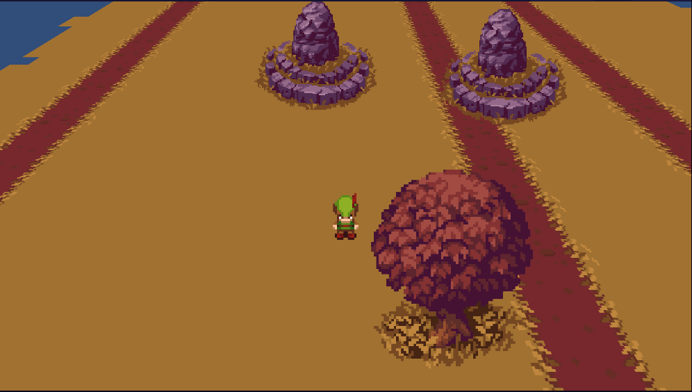

# Don't Starve-like 2.5D Game Perspective Rotation Demo
This repository is a demonstration project showcasing a 2.5D perspective rotation similar to the game 'Don't Starve.' In this demo, we aim to simulate the unique perspective effect found in the game 'Don't Starve,' where the visuals are presented in a 2.5D (semi-3D) fashion.

Through this demonstration project, you will be able to experience the perspective rotation effect within an environment reminiscent of 'Don't Starve.' We utilize advanced graphics techniques and animation effects to allow players to freely rotate their viewpoint within the game, enabling better observation and exploration of the game world.

The purpose of this demo project is to showcase the implementation of perspective rotation and provide a learning and reference resource for developers and game enthusiasts. By examining the code and related documentation, you can gain insights into how we achieved this 2.5D perspective rotation effect and apply similar functionality in your own projects.

Whether you are interested in game development or a fan of 'Don't Starve,' this demo project offers an opportunity to personally experience a similar perspective rotation. Explore and feel the changes in perspective within a 2.5D environment, gaining a deeper understanding of the creative and implementation processes behind visual effects in games.

All artwork is from the Unity Store.

<table>
  <tr>
    <td>
      
    </td>
    <td>
      
    </td>
  </tr>
</table>
